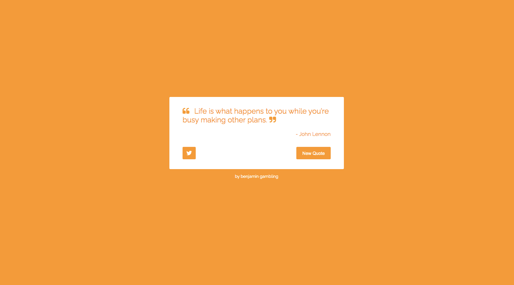

# Weather ToDo

This project was created using React and bootstrapped with [Create React App](https://github.com/facebook/create-react-app).

# 

## Table of contents

1. [Demo](#demo)
2. [Technologies](#technologies)
3. [Features](#features)
4. [Development](#development)
5. [License](#license)

## Demo

Here is the working live demo:
[https://benjamin-gambling.github.io/](https://benjamin-gambling.github.io/).

## Technologies

- [ReactJS](https://reactjs.org/)

  

## Features

-

### Devlopment

-

## License

> You can check out the full license [here](LICENSE)

This project is licensed under the terms of the **MIT** license.
